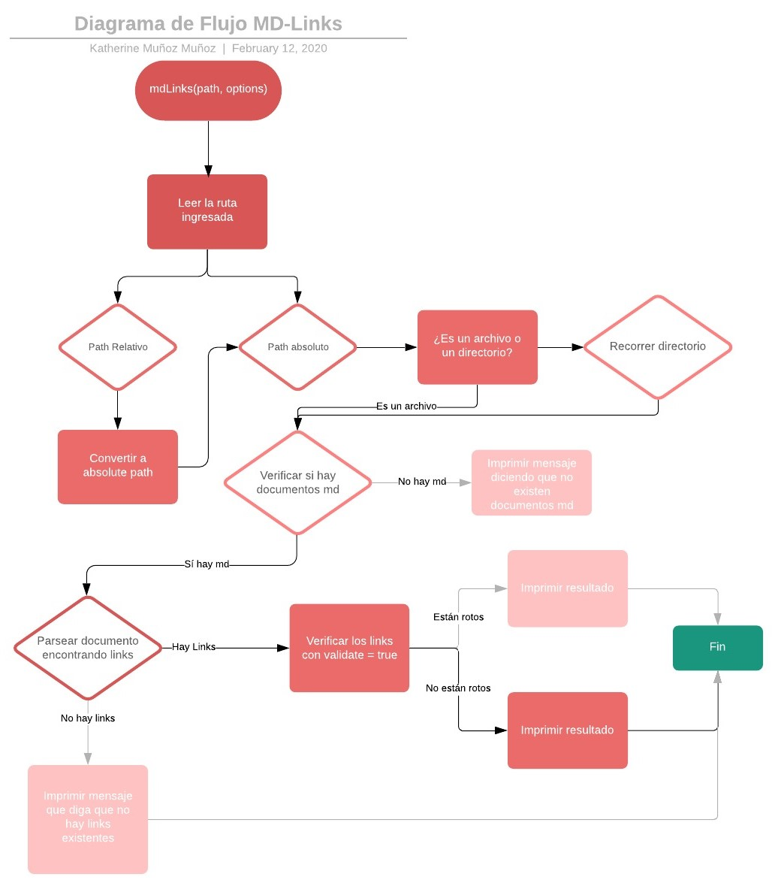

# Markdown Links

## Índice

* [1. Preámbulo](#1-preámbulo)
* [2. Diagrama de flujo](#2-diagrama-de-flujo)
* [3. Instrucciones de uso](#3-instrucciones-de-uso)
* [4. Especificaciones técnicas](#4-especificaciones-tecnicas)

***

## 1. Preámbulo

[Markdown](https://es.wikipedia.org/wiki/Markdown) es un lenguaje de marcado
ligero muy popular entre developers. Es usado en muchísimas plataformas que
manejan texto plano (GitHub, foros, blogs, ...), y es muy común
encontrar varios archivos en ese formato en cualquier tipo de repositorio
(empezando por el tradicional `README.md`).

Estos archivos `Markdown` normalmente contienen _links_ (vínculos/ligas) que
muchas veces están rotos o ya no son válidos y eso perjudica mucho el valor de
la información que se quiere compartir.

Dentro de una comunidad de código abierto, nos han propuesto crear una
herramienta usando [Node.js](https://nodejs.org/), que lea y analice archivos
en formato `Markdown`, para verificar los links que contengan y reportar
algunas estadísticas.

## 2. Diagrama de Flujo

A modo de planificación, primero construí un diagrama de flujo para estructurar cada parte de mi librería, desde la cosntrucción de la función principal md-links, hasta la solución final de mostrar los links según su estado.

## 3. Intrucciones de uso

### IMPORTANTE: Para hacer uso de esta librería, debes tener instalado [Node.js](https://nodejs.org/en/) en tu computador. 

1. Para instalar la librería, debes ejecutar los siguientes comandos en la terminal.

`npm install katsmunoz/md-links `

2. Para utilizarla, debes escribir el nombre de la librería y luego, la ruta de archivo que quieres leer.

`md-links <path-to-file>`

*Cabe destacar, que esta ruta puede ser absoluta o relativa.*

Ruta relativa: `md-links links.md`

Ruta absoluta: `md-links C:\Users\katsm\OneDrive\Escritorio\LABORATORIA\LABORATORIA\SCL012-MD-Links-\links.md`

3. Una vez ingresada la ruta, te mostrará todos los links contenidos en el archivo con extensión .md junto con el status de cada link. 

`$ md-links links.md
README.md https://nodejs.org/ 200 OK!
README.md https://medium.com/coding-and-web-development/learnyounode 404 Not found`

*Próximamente, se agregarán las opciones de --validate y --stats para entregar más estadísticas sobre los links encontrados.*

## 4. Especificaciones técnicas

|Especificaciones técnicas|
| ---------------------- |
| **Lenguaje**           |
|JavaScript              |
| **Ejecución**          |
|Node.js                 |
| **Módulos NPM**        |
|File System(fs)         |
|Path                    |
| **Librerías**          |
|[chalk](https://www.npmjs.com/package/chalk)|
|[node-fetch](https://www.npmjs.com/package/node-fetch)|
|[markdown-link-extractor](https://www.npmjs.com/package/markdown-link-extractor)|
| **Testing**            |
|Jest (pruebas unitarias)|
|ESlint                  |
| **Otros**              |
|module.exports          |
